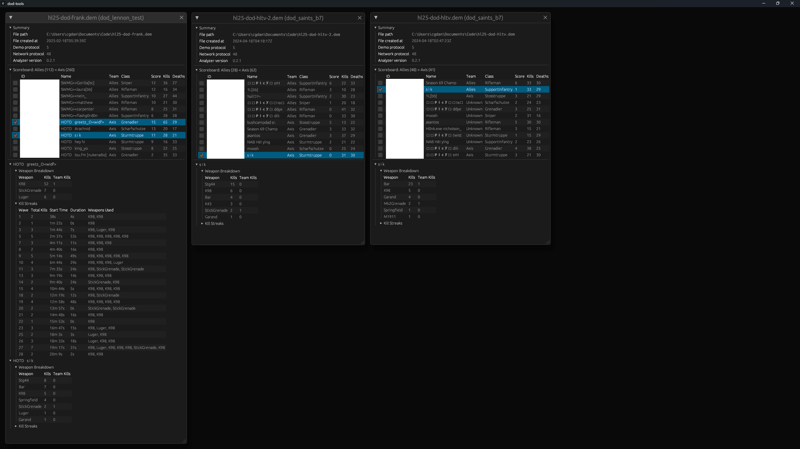

# dod-tools

A utility for analyzing Day of Defeat (GoldSrc) demo files.



[Example text output](assets/example_report.md)

## Installation

Download the binaries for your platform from the [latest release](https://github.com/cgdangelo/dod-tools/releases/latest).

## Usage

> [!TIP]
>
> For best results, use on POV demos where you:
>
> - Started recording after the clan match timer has finished and teams were respawned
> - Stopped recording when the match was over
>
> Demos recorded by HLTV clients or legacy versions of DoD (1.0, 1.1, 1.2) have limited support.

### GUI mode

Run the `dod-tools-gui` program and drag-and-drop 1 or more files onto the main window. Each file will open a report window.

Click the checkbox next to a player in the scoreboard to filter for their results across all open reports.

### CLI mode

<!-- help-start -->

```text
Usage: dod-tools-cli.exe [OPTIONS] [DEMO_PATHS]...

Arguments:
  [DEMO_PATHS]...
          List of paths to demo files

Options:
      --output-format <OUTPUT_FORMAT>
          The kind of string output to produce from an analysis

          [default: markdown]

          Possible values:
          - markdown: Markdown document best used in combination with a Markdown renderer
          - json:     JSON string for automated tools or custom visualization

  -h, --help
          Print help (see a summary with '-h')

  -V, --version
          Print version
```

<!-- help-end -->

#### Example 1: Viewing with a Markdown renderer (recommended)

> [!TIP]
>
> The report is too long to be readable in a terminal.
>
> For improved readability, use something that can render Markdown text to HTML, such as:
>
> - [Visual Studio Code](https://code.visualstudio.com/docs/languages/markdown)
> - https://peerpad.net/
> - https://markdownlivepreview.com/

For quick analysis of a single file, run the program and capture the output to your clipboard. On Windows, for example:

```text
dod-tools-cli.exe "C:\path\to\demo-file.dem" | clip
```

The report contents will be in your clipboard now. Paste this into something that can render Markdown text as HTML (see
above).

#### Example 2: Aggregating results from a list of files into a Markdown document

If you have a list of files in a directory you want to analyze at once, run the program on each file and aggregate the
results into a single file.

```text
Get-ChildItem "C:\path\to\demos\*.dem" | ForEach-Object { & dod-tools-cli.exe $_.FullName >> reports.md }
```

A `reports.md` file will be created with sections for each of the files.

#### Example 3: JSON output

Use the `--output-format json` option to print an array of JSON objects.

```text
dod-tools-cli.exe --output-format json "C:\path\to\demo-file.dem" > report.json
```
